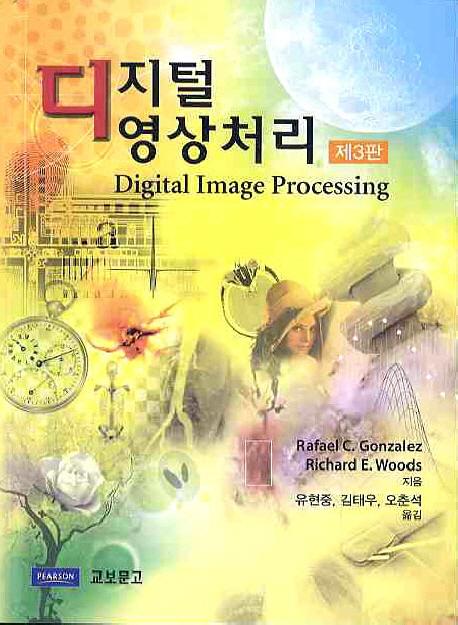
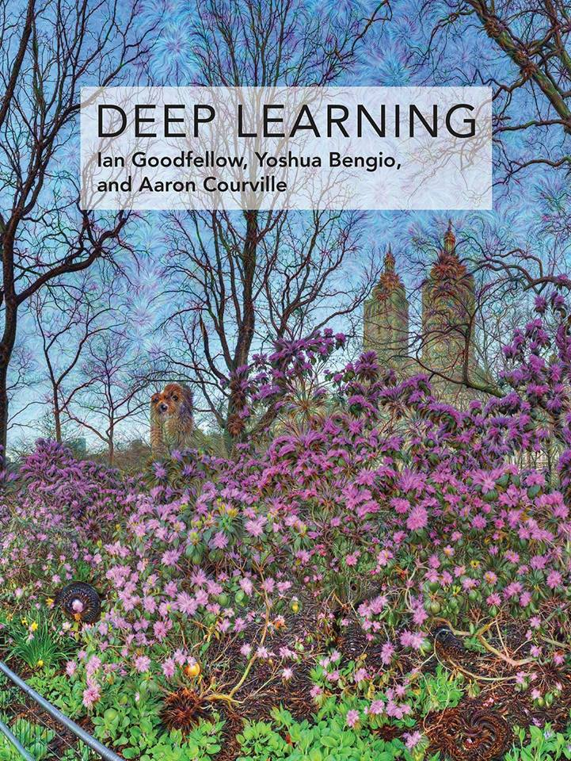

# V.AIS (Vision & Artificial Intelligence Study)
---

- 이 페이지는 [Vision & A.I. Study](https://open.kakao.com/o/ghU9D1o) 오픈채팅 사용자를 위한 페이지입니다.

- 건의 사항, 추가 정보는 [이슈](https://github.com/OpenCVDL/OpenCVDL.github.io/issues) 에 등록해주세요!

## 공 지 사 항
- 광고는 방장, 부방장 허락 후 게시 !

- 본인 개인정보 언급 :o:

- 타인 개인정보 언급 :x:

- 타인 개인정보 캐내기 :x:

- 닉네임 양식 통일!
  - [닉네임/분야] 필수!:star:

  - [경력/소속] 선택!

  - 예시) Jerry/의료영상/석사과정

## 세미나 자료
  -  제 1회 V.AIS 세미나 자료 [다운로드](https://github.com/V-AIS/v-ais.github.io/raw/master/files/The_1st_V_ais_Seminar.zip)

## 자료 모음집
- :star: : 추천도
- :skull: : 난이도

### 동영상 강의
#### 영어
  - **CS231n**
    [2016_링크](https://www.youtube.com/playlist?list=PLlJy-eBtNFt6EuMxFYRiNRS07MCWN5UIA), [2017_링크](https://www.youtube.com/watch?v=vT1JzLTH4G4&list=PL3FW7Lu3i5JvHM8ljYj-zLfQRF3EO8sYv) :star: :star: :star: :skull: :skull:  
    Computer Vision 분야에서 가장 중요하고 기초적인 스탠포드 대학 강의

  - **구글 머신러닝 단기집중과정 (한글자막)**
    [링크](https://developers.google.com/machine-learning/crash-course/) :star: :skull:  
    구글에서 제작한 비전공자들도 쉽게 들을 수 있는 강의

  - **Udacity Computer Vision(영어자막)** :star: :skull: :skull:
    [링크](https://www.udacity.com/course/introduction-to-computer-vision--ud810)  
    Computer Vision 개론 강의  
    학부 4학년과 석사과정에서 수강할 수 있는 가장 기본적인 컴퓨터 비전 강의  
    강의 PPT는 [여기](https://www.cc.gatech.edu/~afb/classes/CS4495-Spring2015-OMS/)에서 찾아보실 수 있습니다.

  - **MIT 18.06 Gibert Strang (영어자막)**
    [링크](https://www.youtube.com/watch?v=ZK3O402wf1c&list=PLE7DDD91010BC51F8)

  - **Khan Academy linear algebra (한글자막)**
    [링크](https://ko.khanacademy.org/math/linear-algebra)

  - **Stanford CS229 기계학습 개론(영어자막)** :star: :skull:
    [링크](https://see.stanford.edu/Course/CS229)  
    Stanford 에서 열린 단학기용 기계학습 강의입니다.  
    Andrew Ng 교수님이 직접 강의하셨습니다.  
    기계학습 입문용 강의로 가정 적절합니다.

  - **Carnegie Mellon University 기계학습 개론(영어자막)** :skull:
    [링크](http://www.cs.cmu.edu/~tom/10701_sp11/)  
    카네기 멜런 대학교에서 열린 단학기용 기계학습 개론 강의입니다.  
    Tom Mitchell 교수님이 직접 강의하셨습니다.  
    Stanford CS229 와 비슷한 수준의 강의입니다.

  - **Stanford Statistical Learning 데이터마이닝 개론(영어자막)** :skull: :skull:
    [링크](https://lagunita.stanford.edu/courses/HumanitiesSciences/StatLearning/Winter2016/info)  
    데이터마이닝 개론 강의입니다.  
    세부적인 내용에서 차이가 있으나,  기계학습과 큰 틀에서 보면 비슷한 내용입니다.  

  - **Probabilistic Graphical Models(영어자막)**  
    [1. 기초](https://www.coursera.org/specializations/probabilistic-graphical-models) :skull: :skull:   
    Stanford 대학교 교수님이신 Daphne Koller 교수님의 베이지언 모델 강의입니다.  
    학부 수준의 베이지언 통계의 선수를 요구합니다.  
    대부분의 모델들이 딥러닝 Framework 를 사용해서 구현할 수 없는 모델들입니다.  
    구현 실력을 기르는 데에 큰 도움이 되는 과목입니다.  
    [2. 심화](http://www.cs.cmu.edu/~epxing/Class/10708/)  :skull: :skull: :skull:  
    Carnegie Mellon University 에서 열린 베이지언 모델의 박사수준 강의입니다.  
    위의 기초 강의와 함수해석학의 선수를 요구합니다.(다만 강의에서 제공하는 reading material 로 어느정도 대체할 수는 있습니다.)

  - **UCCS Functional Analysis (영어자막)** :skull: :skull: :skull:
    [Youtube](https://www.youtube.com/playlist?list=PLBC73B96341ECF455)  
    기초적인 함수해석학의 내용을 학습할 수 있는 강의입니다.

  - **Stanford Convex Optimization (영어자막)** :skull: :skull:  
    [1. Theory](https://see.stanford.edu/Course/EE364A)  
    딥러닝의 솔루션을 찾아내는 optimizer에 대한 기본적인 이론을 학습할 수 있는 강의입니다.  
    선형대수학을 선수과목으로 요구합니다.  
    [2. Extensions](https://see.stanford.edu/Course/EE364B)  
    위의 개론강의에서 기초적인 알고리즘을 소개했다면,  
    심화강의에서는 본격적으로 개발에 쓰일 수 있는 알고리즘 위주로 강의가 진행됩니다.

  - **Cambridge Information Theory(영어자막)** :skull: :skull:
    [링크](http://videolectures.net/course_information_theory_pattern_recognition/)  
    딥러닝과 Probabilistic Graphical Models 에서 자주 쓰이는 Shannon's information theory 에 대한 개론입니다.   
    딥러닝 모델에 대한 정보이론적 접근을 학습할 수 있습니다.

  - **NPTEL Statistical Inference(영어자막)** :skull: :skull: :skull:
    [링크](http://nptel.ac.in/courses/111105043/)  
    통계학과 석사 수준의 추정검정론입니다.  
    학부 수준의 수리통계학 선수를 요구합니다.  

  - **NPTEL Probability Theory(영어자막)** :skull: :skull: :skull:
    [링크](http://nptel.ac.in/courses/108106083/)  
    측도론을 사용하는 확률론입니다.  
    학부 혹은 석사수준의 실변수함수론을 선수과목으로 요구합니다.  
    고전적인 기계학습 모델들의 논문들을 찾으시다 보면 측도론을 사용해서 해석을 하는 경우가 종종 있습니다.   
    이 때, 확률론을 알고 계시다면 이해하시는 데에 큰 도움이 됩니다.

  - **NPTEL Stochastic Process(영어자막)** :skull: :skull: :skull:
    [링크](http://nptel.ac.in/courses/111102014/)  
    학부 4 학년 수준의 확률과정론입니다.  
    Martingale 을 설명할 때를 제외하고는 크게 Measure Theory 가 필요한 강의는 아닙니다.  
    최근 Bayesian Deep Learning 에서 Stochastic Process 이론을 크게 활용하는 논문들이 있습니다. 해당 논문을 이해하실 때 도움이 될 것입니다.

  - **MIT Principles of Digital Communication(영어자막)** :skull: :skull:
    [링크](https://ocw.mit.edu/courses/electrical-engineering-and-computer-science/6-450-principles-of-digital-communications-i-fall-2006/)  
    신호 처리에 대한 개론강의입니다.  
    Cambridge Information Theory 와 같이 수강하시면 시너지 효과가 있는 강의입니다.  
    강의 중에 Fourier Analysis 내용을 다루기는 합니다만, Fourier Analysis 에 대한 선수를 요구하는 수준입니다.  

  - **NPTEL Digital Image Processing(영어자막)** :skull: :skull:
    [링크](https://nptel.ac.in/courses/117105079/)  
    영상처리 개론강의입니다.  
    영상처리의 기본이 되는 morphological operator 부터 신호처리적인 해석까지 폭넓게 배우실 수 있습니다.

  - **Multiview Geometry(영어자막)** :skull: :skull:
    [Youtube](https://www.youtube.com/playlist?list=PLTBdjV_4f-EJn6udZ34tht9EVIW7lbeo4)  

#### 한글
  - **모두의 딥러닝**
    [링크](http://hunkim.github.io/ml/) :star: :star: :star: :skull:  
    딥러닝 입문자들에게 추천하는 국내 1위 강의  
    딥러닝 뿐만이 아니라 RL(Reinforcement Learning) 강의 포함

  - **KAIST 기계학습 개론**
    [링크](http://seslab.kaist.ac.kr/xe2/courses)  
    KAIST 산업공학과 문일철 교수님의 기계학습 개론강의입니다.  
    Stanford, CMU 강의가 영어자막이라 이해에 어려움을 가지고 계신 분들을 위한 가장 좋은 대안입니다.

  - **테리의 딥러닝 토크**
    [링크](https://www.youtube.com/playlist?list=PL0oFI08O71gKEXITQ7OG2SCCXkrtid7Fq) :star: :skull:  

  - **PR12 딥러닝 논문읽기 모임**   
    [Season 1](https://www.youtube.com/playlist?list=PLWKf9beHi3Tg50UoyTe6rIm20sVQOH1br) :star::star::star: :skull::skull:   
    [Season 2](https://www.youtube.com/playlist?list=PLWKf9beHi3TgstcIn8K6dI_85_ppAxzB8) :star::star::star: :skull::skull:    
    주요 논문에 대한 해설 강의  
    논문을 읽기 전, 맛보기 역할

  - **머신러닝을 위한 Python (최성철 교수)**
    [링크](http://www.edwith.org/aipython) :star: :star: :skull:  
    파이썬 강의 및 데이터 분석 관련 모듈(numpy, pandas, ...)에 관한 강의  
    파이썬 입문자에게 추천

  - **머신러닝을 위한 선형대수(주재걸 교수)**
    [링크](http://www.edwith.org/linearalgebra4ai), [자료](https://github.com/V-AIS/v-ais.github.io/raw/master/files/머신러닝을_위한_선형대수.zip) :star::star: :skull:

  - **Uniwise 해석학 3 시리즈(유료)**  
    [1. 해석개론](http://uniwise.co.kr/uniwiseWeb/lecture/movieLectureDetail.html?subNo=2&searchSubjectCode=1020&searchLeccode=D201500118):skull: :skull:  
    전공수학의 가장 기초인 해석개론에 대한 강의입니다.  
    [2. 위상수학](http://uniwise.co.kr/uniwiseWeb/lecture/movieLectureDetail.html?subNo=2&searchSubjectCode=1128&searchLeccode=D201500138):skull: :skull:  
    해석개론을 수강하시고 나서, 좀 더 고급 수학을 접하시고자 할 때 반드시 필요한 General Topology 에 대한 내용을 담고 있습니다.  
    [3. 실해석학](http://uniwise.co.kr/uniwiseWeb/lecture/movieLectureDetail.html?subNo=2&searchSubjectCode=1223&searchLeccode=D201500250):skull: :skull: :skull:  
    대학원 수준의 고급수학의 첫 단계인 실해석학 개론입니다.  
    실해석학에서는 현대적인 확률통계론의 근간이라고 할 수 있는 측도론에 대한 첫 발을 내딛으시게 됩니다.

### 책

|    책 이름     | 사진       | 추천도 & 난이도 | 한줄평   |
| :-------------: |:-------------:| :-----: | :------:|
| 디지털 영상 처리  |  | :star::star: :skull::skull::skull:  |  추후 작성|
| 컴퓨터 비전      |       |   :star::star: :skull::skull: |    추후 작성|
| 기계학습        |      |    :star::star: :skull::skull:   |    추후 작성|
| 밑바닥부터 시작하는 딥러닝        |      |    :star::star::star: :skull:   |       추후 작성|
| DEEP LEARNING|     |  :star::star::star: :skull::skull::skull:   |       추후 작성|

### 블로그
  - **브랜치(Amang Kim 개인블로그)** [링크](https://brunch.co.kr/@amangkim)  

  - **우아한 형제들** [링크](http://woowabros.github.io/)  

  - **홍정모 교수님 개인 블로그** [링크](https://blog.naver.com/prologue/PrologueList.nhn?blogId=atelierjpro)  

  - **이기창님 개인 블로그** [링크](https://ratsgo.github.io/)

  - **라온피플** [링크](https://laonple.blog.me/221019319607)  

  - **위키독스(Machine)** [링크](https://wikidocs.net/book/587)  

  - **State Of the Art Object Detection 자료 모음** [링크](https://handong1587.github.io/deep_learning/2015/10/09/object-detection.html)

  - **Python 모듈 설명 모음** [링크](http://awesome-python.com/)

  - **선형대수학 강의 요약 블로그** [링크](http://twlab.tistory.com/m)  
   MIT 선형대수학 강의를 한글로 정리

### PPT
  - **선형대수 요약**
[링크1](https://towardsdatascience.com/linear-algebra-cheat-sheet-for-deep-learning-cd67aba4526c) [링크2](http://cs231n.github.io/python-numpy-tutorial/)

  - **CS230 텐서플로우 기초 정리** [링크](https://cs230-stanford.github.io/tensorflow-getting-started.html)

  - **Deep Systems (Ru)**
[링크](https://deepsystems.ai/reviews)

  - **오일석 교수님 ppt**
[링크](http://cv.jbnu.ac.kr/index.php?mid=ml)

### Company Research Page
- 네이버 : [링크](http://d2.naver.com/home)  
- 카카오 : [링크](http://tech.kakao.com/)  
- nvidia : [링크](https://www.nvidia.com/en-us/research/)  
- facebook : [링크](https://research.fb.com/)
- facebook ai : [링크](https://facebook.ai)  
- google : [링크](https://research.google.com/)  
- amazon : [링크](https://www.amazon.jobs/en/job_categories/research-science)  
- ibm : [링크](http://www.research.ibm.com/)  

### Facebook Pages
- 생활코딩 : [링크](https://www.facebook.com/groups/iamplanner/)  
- AI KOREA : [링크](https://www.facebook.com/groups/AIKoreaOpen/)  
- Tensorflow KOREA : [링크](https://www.facebook.com/groups/TensorFlowKR/about/)  
- 새벽을 여는 IT 연구소 : [링크](http://www.tdii.me/)  

### reddit
- Computer Vision : [링크](https://www.reddit.com/r/computervision/)  
- Machine Learning : [링크](https://www.reddit.com/r/MachineLearning/)  

### Magazine
- 기글 : [링크](https://gigglehd.com/gg/)  
- 보안뉴스 : [링크](http://www.securityworldmag.co.kr/)  
- 인공지능신문 : [링크](http://www.aitimes.kr/)  

### Paper arxiv
- 아카이브 새니티 : [링크](http://www.arxiv-sanity.com/)  

### OpenCV
- opencv 네이버 카페 : [링크](http://cafe.naver.com/opencv)  
- opencv 관련 질문 : [링크](http://answers.opencv.org/questions/)
(git에서 issue 외에 단순 질문 올라옴)

### 환경 구축 관련
- Ubuntu 16.04.1에 CUDA & cudnn 설치하기 : [링크](http://jerrytory.tistory.com/4?category=695214)

- Ubuntu 16.04에 Python-opencv 설치하기 : [링크](https://m.blog.naver.com/samsjang/220758479643)
