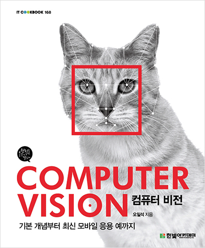
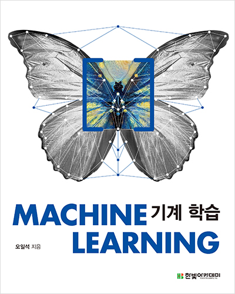

# 공 지 사 항

- 이 페이지는 [영상처리 비젼, 딥러닝, 로봇 개발자](https://open.kakao.com/o/ghU9D1o) 오픈채팅 사용자를 위한 페이지입니다.

- 닉네임을 닉네임/분야/직업 등으로 되도록이면 변경해주세요!

- 건의 사항, 추가 정보는 [이슈 등록](https://github.com/OpenCVDL/OpenCVDL.github.io/issues) 에 등록해주세요!
## 자료 모음집

### Company Research Page
- 네이버 : [링크](http://d2.naver.com/home)  
- 카카오 : [링크](http://tech.kakao.com/)  
- nvidia : [링크](https://www.nvidia.com/en-us/research/)  
- facebook : [링크](https://research.fb.com/)  
- google : [링크](https://research.google.com/)  
- amazon : [링크](https://www.amazon.jobs/en/job_categories/research-science)  
- ibm : [링크](http://www.research.ibm.com/)  

### Facebook Pages
- 생활코딩 : [링크](https://www.facebook.com/groups/iamplanner/)  
- AI KOREA : [링크](https://www.facebook.com/groups/AIKoreaOpen/)  
- Tensorflow KOREA : [링크](https://www.facebook.com/groups/TensorFlowKR/about/)  
- 새벽을 여는 IT 연구소 : [링크](http://www.tdii.me/)  

### reddit
- Computer Vision : [링크](https://www.reddit.com/r/computervision/)  
- Machine Learning : [링크](https://www.reddit.com/r/MachineLearning/)  

### Magazine
- 기글 : [링크](https://gigglehd.com/gg/)  
- 보안뉴스 : [링크](http://www.securityworldmag.co.kr/)  
- 인공지능신문 : [링크](http://www.aitimes.kr/)  

### Paper arxiv
- 아카이브 새니티 : [링크](http://www.arxiv-sanity.com/)  

### OpenCV
- opencv 네이버 카페 : [링크](http://cafe.naver.com/opencv)  
- opencv 관련 질문 : [링크](http://answers.opencv.org/questions/)
(git에서 issue 외에 단순 질문 올라옴)

### 강좌들
- 구글 텐서플로우 강좌(한글가능): [링크](https://developers.google.com/machine-learning/crash-course/)  
- Terry님 딥러닝 강좌: [링크](https://www.youtube.com/watch?v=D4zqigCb8co&list=PL0oFI08O71gKEXITQ7OG2SCCXkrtid7Fq )  
- Sung Kim 딥러닝 강좌(모두의 딥러닝): [링크](https://www.youtube.com/watch?v=BS6O0zOGX4E&list=PLlMkM4tgfjnLSOjrEJN31gZATbcj_MpUm)  
- PR12 딥러닝 논문 세미나: [링크](https://www.youtube.com/playlist?list=PLlMkM4tgfjnJhhd4wn5aj8fVTYJwIpWkS)  
- CS231n 2016(Andrej Karpathy): [링크](https://www.youtube.com/playlist?list=PLlJy-eBtNFt6EuMxFYRiNRS07MCWN5UIA)  
- CS231n 2017(Justin Johnson, Serena Yeung): [링크](https://www.youtube.com/watch?v=vT1JzLTH4G4&list=PL3FW7Lu3i5JvHM8ljYj-zLfQRF3EO8sYv)  
- 머신러닝을 위한 선형대수 :
[링크](http://www.edwith.org/linearalgebra4ai)  
- 머신러닝을 위한 Python :
[링크](http://www.edwith.org/aipython)  
- Deep Systems (Ru) :
[링크](https://deepsystems.ai/reviews)   매우 좋은 강좌를 해주고 설명이 매우 잘 되어있는 PPT를 제공한다. 단점은 러시아어로 설명해준다 ㅎㅎ.. 그래서 PPT를 주로 사용한다.  
- 오일석 교수님 ppt :
[링크](http://cv.jbnu.ac.kr/index.php?mid=ml)  
- 선형대수 :
[링크1](https://towardsdatascience.com/linear-algebra-cheat-sheet-for-deep-learning-cd67aba4526c) [링크2](http://cs231n.github.io/python-numpy-tutorial/)

### 기술 블로그
- 브랜치(Amang Kim 개인블로그) : [링크](https://brunch.co.kr/@amangkim)  
- 생활코딩 : [링크](http://woowabros.github.io/)  
- 홍정모 교수님 개인 블로그 : [링크](https://blog.naver.com/prologue/PrologueList.nhn?blogId=atelierjpro)  
- 이기창님 개인 블로그 : [링크](https://ratsgo.github.io/)
- 라온피플 : [링크](https://laonple.blog.me/221019319607)  
- 위키독스 : [링크](https://wikidocs.net/book/587)  

### 추천 서적
- 디지털 영상 처리  

- 컴퓨터 비전  

- 밑바닥부터 시작하는 딥러닝  

- 기계학습  

- MIT books  

### 환경 구축 관련
- Ubuntu 16.04.1에 CUDA & cudnn 설치하기 : [링크](http://jerrytory.tistory.com/4?category=695214)

- Ubuntu 16.04에 Python-opencv 설치하기 : [링크](https://m.blog.naver.com/samsjang/220758479643)
